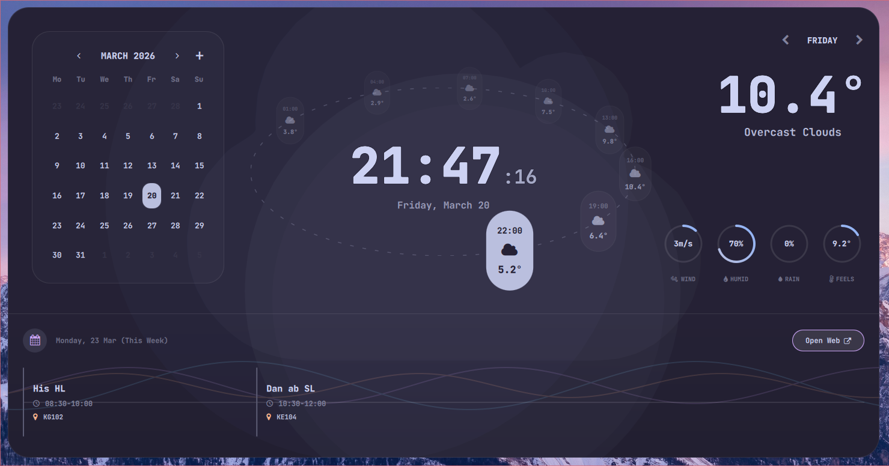
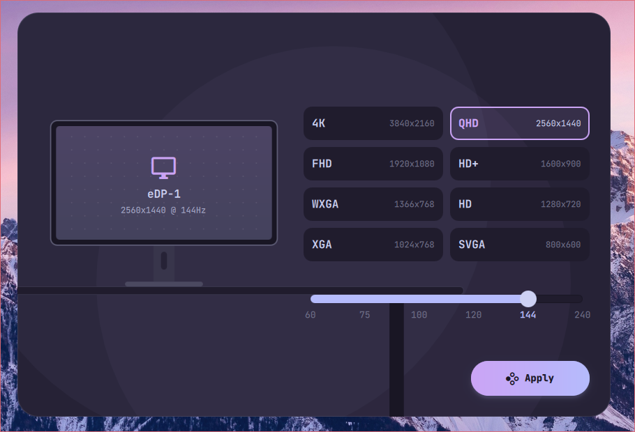

# NixOS · Hyprland · Matugen

A fully dynamic, wallpaper-driven NixOS configuration built around Hyprland and [Matugen](https://github.com/InioX/matugen). Change your wallpaper — every application recolors itself automatically.

---

## Screenshots








---

## What's Inside

**Window Manager:** Hyprland with smooth animations, rounded corners, and modular config split across `monitors`, `keybindings`, `rules`, `autostart`, and `settings` files.

**Dynamic Theming:** Matugen generates a Material You palette from your wallpaper and pushes colors to every application simultaneously — no manual theming needed.

**Shell:** Zsh with oh-my-zsh, autosuggestions, syntax highlighting, and custom functions like `fetch` (dynamic fastfetch) and `qcopy` (fzf file picker that copies content to clipboard for LLM use).

**UI Shell:** Quickshell powers the top bar, floating widgets, lock screen, and panels for music, calendar, wallpaper, network, volume, clipboard, and more.

---

## Applications Configured

| App | Role |
|-----|------|
| Kitty | Terminal (JetBrains Mono, 80% opacity) |
| Neovim | Editor with LSP, Treesitter, Telescope, dynamic Matugen colors |
| Rofi | App launcher (grid layout, matugen-themed) |
| SwayNC | Notification center |
| SwayOSD | Volume / brightness OSD |
| Cava | Audio visualizer with gradient colors |
| Vesktop | Discord with Midnight theme recolored by Matugen |
| Firefox | Custom userChrome + matugen colors, YouTube & GitHub themed |
| EasyEffects | System-wide audio processing |
| SWWW | Wallpaper daemon |
| Hypridle | Auto-lock and suspend |
| Plymouth | Custom macOS-inspired boot animation |

---

## Matugen Color Coverage

When you run Matugen against a wallpaper, it regenerates themes for:

- Hyprland border colors
- Kitty terminal colors
- Neovim (live-reloaded via file watcher, no restart needed)
- Rofi
- GTK3 & GTK4
- Qt5 & Qt6 (qt5ct / qt6ct)
- Cava gradient
- SwayNC
- SwayOSD
- Vesktop (Discord)
- Firefox (userChrome + GitHub + YouTube userscripts)
- Quickshell widgets

---

## Hardware

This config targets a laptop with:

- AMD CPU (amd_pstate=active, performance governor)
- NVIDIA GPU (hybrid graphics via PRIME offload, stable driver)
- 1920×1080 @ 144 Hz display

You will need to adjust `config/sessions/hyprland/config/monitors.conf` and the PRIME bus IDs in `configuration.nix` for your own hardware.

---

## Installation

> **Warning:** This is a personal configuration. It is not a turnkey installer. Treat it as a reference or borrow specific pieces rather than applying it wholesale.

1. Clone the repo to `/etc/nixos`:

```bash
sudo git clone https://github.com/wafflemuncher1/Nixos-hyprland-theme /etc/nixos
```

2. Generate your hardware config:

```bash
sudo nixos-generate-config --show-hardware-config > /etc/nixos/hardware-configuration.nix
```

3. Edit `configuration.nix` to match your username, hostname, GPU bus IDs, and monitor setup.

4. Edit `home.nix` and replace `ilyamiro` with your username and home directory.

5. Apply the configuration:

```bash
sudo nixos-rebuild switch
```

6. After logging in, run Matugen against a wallpaper to generate the initial color palette:

```bash
matugen image /path/to/your/wallpaper.jpg
```

---

## Key Bindings

`$mainMod` is `Super` (Windows key).

| Binding | Action |
|---------|--------|
| `Super + Return` | Open terminal (Kitty) |
| `Super + D` | App launcher (Rofi) |
| `Super + F` | Firefox |
| `Super + E` | Nautilus |
| `Super + W` | Wallpaper picker |
| `Super + R` | Reload config |
| `Super + L` | Lock screen |
| `Super + Space` | Play / pause media |
| `Super + Q` | Music widget |
| `Super + S` | Calendar |
| `Super + N` | Network |
| `Super + V` | Volume |
| `Super + C` | Clipboard |
| `Super + H` | Keybinding guide |
| `Super + M` | Monitor settings |
| `Super + Shift + S` | Settings panel |
| `Super + Shift + T` | Focus timer |
| `Super + 1–9` | Switch workspace |
| `Super + Shift + 1–9` | Move window to workspace |
| `Super + Arrows` | Move focus |
| `Super + Ctrl + Arrows` | Move window |
| `Super + Shift + Arrows` | Resize window |
| `Super + Shift + F` | Toggle floating |
| `Alt + F4` | Close window |
| `Print` | Screenshot (selection) |
| `Shift + Print` | Screenshot + edit |
| `Super + Print` | Fullscreen screenshot |

---

## Shell Aliases

| Alias | Command |
|-------|---------|
| `update` | `sudo nixos-rebuild switch` |
| `edit` | `sudo -E nvim -n` |
| `edconf` | Edit `configuration.nix` in Neovim |
| `stop` | `shutdown now` |
| `out` | Log out current session |
| `fetch` | Dynamic fastfetch with Matugen colors |
| `qcopy` | fzf file picker → copy contents to clipboard |

---

## Structure

```
.
├── configuration.nix          # System-level NixOS config
├── home.nix                   # Home Manager root, auto-imports programs/
├── hardware-configuration.nix # Generated, machine-specific
└── config/
    ├── programs/
    │   ├── cava/              # Audio visualizer
    │   ├── kitty/             # Terminal
    │   ├── matugen/           # Color templates for every app
    │   ├── neovim/            # Neovim + LSP + dynamic theming
    │   ├── plymouth/          # Custom boot animation
    │   ├── rofi/              # App launcher
    │   ├── swayosd/           # Volume/brightness OSD
    │   └── zsh/               # Shell config + custom functions
    └── sessions/
        └── hyprland/
            ├── hyprland.conf  # Root config (sources all modules)
            ├── hypridle.nix   # Idle/lock/suspend settings
            └── config/
                ├── autostart.conf
                ├── env.conf
                ├── keybindings.conf
                ├── monitors.conf
                ├── rules.conf
                ├── settings.conf
                └── variables.conf
```

---

## Credits

- [Matugen](https://github.com/InioX/matugen) — Material You color generation
- [Hyprland](https://hyprland.org) — Wayland compositor
- [Quickshell](https://quickshell.outfoxxed.me) — Shell UI framework
- [midnight-discord](https://github.com/refact0r/midnight-discord) — Discord theme base
- [ArcMidnight Cursors](https://github.com/yeyushengfan258/ArcMidnight-Cursors) — Cursor theme
---